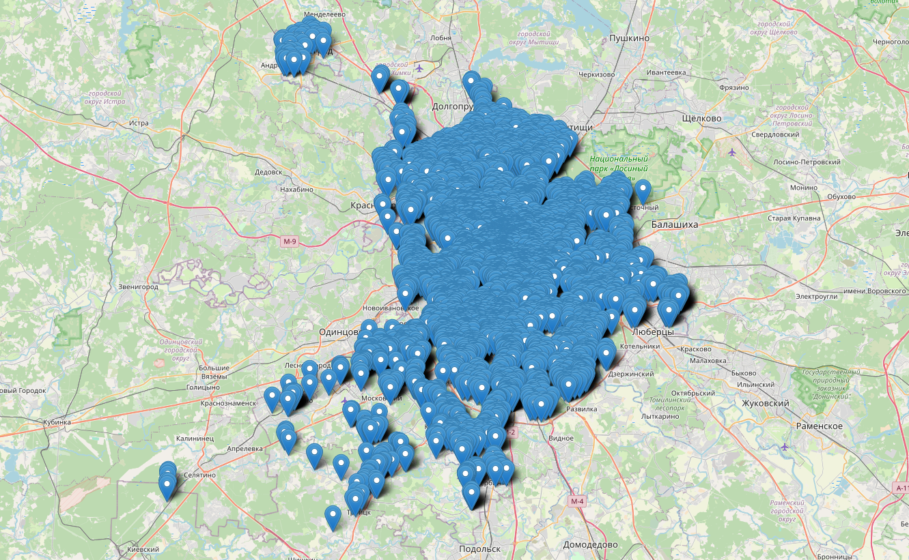
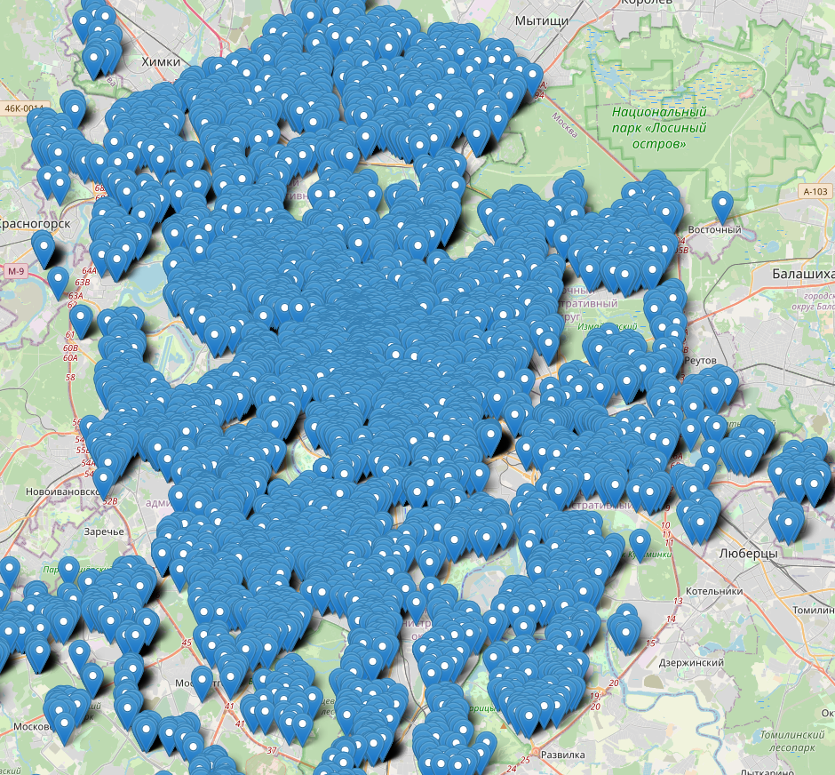
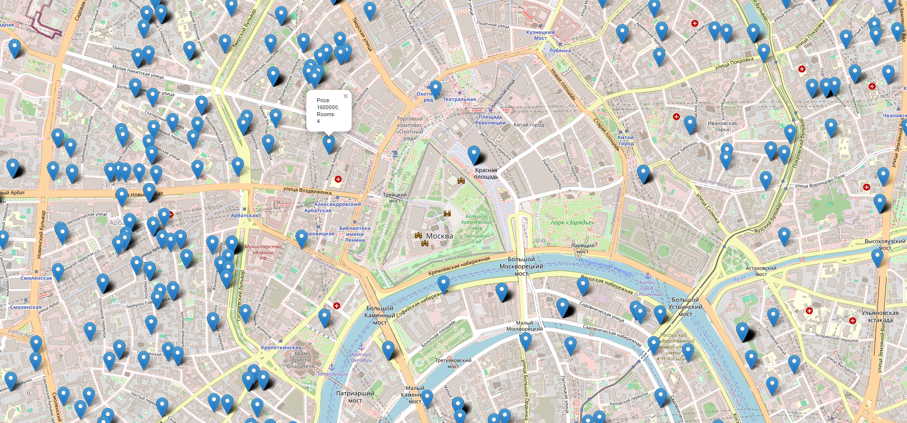

---
header-includes:
- \usepackage{natbib}
- \usepackage[fontsize=12pt]{scrextend}
- \usepackage{indentfirst}
- \usepackage{setspace}
- \usepackage[singlelinecheck=false]{caption}
- \usepackage{float}
- \usepackage{sectsty}
output:
  pdf_document:
    latex_engine: xelatex
    number_sections: true
    extra_dependencies:
    - booktabs
    - caption
indent: yes
geometry: left=3.5cm,right=2.95cm,top=2cm,bottom=2cm
---

\onehalfspacing

```{r setup_and_load_data, echo=FALSE, warning = FALSE, message = FALSE}
knitr::opts_chunk$set(warning = FALSE, message = FALSE, echo=FALSE) 
```

\allsectionsfont{\centering}
\subsectionfont{\raggedright}
\subsubsectionfont{\raggedright}

\pagenumbering{gobble}

\begin{centering}

\vspace{3cm}

\vspace{1cm}

\Large
{NATIONAL RESEARCH UNIVERSITY \\ HIGHER SCHOOL OF ECONOMICS}
\normalsize
\\
{\bf International College of Economics and Finance}
\vspace{1cm}


\Large
\doublespacing
Danila Karapsin\\
Anton Ilchuk\\
{\bf Long-term rental prices forecasting}\\
\normalsize
Project\\
38.04.01 ECONOMICS\\
Master's Programme {\bf 'Financial Economics'}

\vspace{1 cm}

\normalsize
\singlespacing


\mbox{}
\vfill
\normalsize
Moscow 2024

\end{centering}

\newpage


\pagenumbering{arabic}
\setcounter{page}{2}
# Introduction
During the past couple of years the real estate market in Russia has seen quite a few fluctuations, starting from relatively severe drops in prices in 2022 to early 2023 and then seeing an almost complete bounce back in the late 2023 and early 2024, however, that is not where the story ends. While at first the adjacent market of real estate rent prices exhibited a similar trend, now-a-days there are a plethora of news outlets reporting that the rent prices in larger Russian cities are climbing up and up with no end in sight, and Moscow being one of the main culprits of such behavior, recently reaching an all time high for the past five years and the analysts predict that the “cost of rent” will only continue increasing.

For young adults and people in their twenties this news is akin to harrowing as while at their current point in life the struggle to secure living quarters might not be of the first priority due to their ability to live with their parents or have accommodation be provided by their respective university at a reasonable price, at some point the idea of a “personal” place to call home will face them sooner or later. Also, due to the lack of a centralized government body to supervise all of the renting contracts between landlords and tenants and a multitude of various factors that make up the renting price of a certain flat it could be hard to gauge whether the option you found online is a “good deal” or not.

Partially inspired by our personal experiences, our project's main idea is developing a machine learning model to accurately forecast long-term rental prices for various types of flats in Moscow. The model will analyze a range of features, including the number of rooms, floor number, total square area, location (district, street, closest underground metro), and additional characteristics such as whether the listing is from an individual or an agency. By leveraging this dataset, the model will provide rental price predictions based on current market trends and attributes of the flat in question. The goal is to create a reliable, data-driven tool that can be used by potential tenants, landlords, and real estate agencies to make informed decisions about rental pricing. This project aims to bring efficiency and precision to Moscow’s rental market, offering a better understanding of pricing fluctuations in a rapidly changing urban environment. Hence understanding the market behavior and trends could not only give us valuable insights, but also potentially find the “best” renting place in Moscow under certain parameters.

All python scripts and csv files which will be mentioned further are available at the github page of our project: https://github.com/Karapsin/ICEF_ML_Project.

\newpage

# Section 2
Our project fits naturally within the realm of machine learning because it involves building a predictive model that learns from past data to make informed forecasts about other rental prices. At its core, machine learning is about using algorithms that improve their performance as they are exposed to more data, and our goal is to train a model that can accurately predict rental prices based on key features of the flats. These features, such as the size of the apartment, number of rooms, location (district and proximity to metro stations), and even whether the listing is posted by an individual or an agency, serve as the input data, while the rental price is the output we are aiming to predict. This is, by definition, a supervised learning task because we have labeled data (historical rental prices) that we can use to train our model. To go into even more detail, it’s a regression problem because the target variable, the rental price, is continuous rather than discrete (i.e., it can take on a wide range of possible values).

There are several types of machine learning models that we could apply to solve this problem. Linear regression might be the simplest approach, allowing us to model the relationship between flat characteristics and price in a straightforward, interpretable way. However, more sophisticated algorithms like decision tree regressorts (CART), k-nearest neighbors regression, or gradient boosting machines can capture more complex, non-linear relationships between variables. Say for example that  the combination of location and number of rooms affects the price in a way that simple models might not account for or, maybe, being next to certain metro stations could have an exponential effect on rent, or certain districts may have unique pricing dynamics. This is where using machine learning offers clear advantages over traditional methods as Non-ML approaches often rely on predefined assumptions and human judgment, which might overlook subtle patterns in the data. Machine learning, on the other hand, can autonomously uncover these hidden relationships and learn from the data without requiring explicit programming for every rule or condition. Moreover, machine learning models excel at handling large datasets with numerous variables, making them ideal for complex, real-world applications like real estate forecasting. As the model processes more data, it can refine its predictions and adapt to new trends, making it a powerful tool in a dynamic and unpredictable market like Moscow’s rental sector, while, in contrast, traditional methods often struggle with high-dimensional data and may produce static results that do not account for changing market conditions or for some “niche” and unclear dependencies like the ones we theorized before, while being a non-issue for the ML models, that can handle interactions between multiple variables just fine.A properly trained ML algorithm will not be surprised by the fact that the combination of floor level and distance to the city center may jointly impact rent. These capabilities make machine learning far more flexible and accurate for the kind of predictive analysis we are aiming to perform, offering not just a snapshot of the current market but a robust forecasting tool that can provide deeper insights into how rental prices may evolve.

\newpage

# Section 3

In this project we decided to use publicly available information about long term rent adverts from the famous cian.ru. Unfortunately, Cian Ltd, which owns this site, is trying to commercialize this data, by implementing multiple data parsing counter-measures and selling access to it at an unreasonable price. Thankfully, we do not need to invent a wheel since there are multiple workarounds and one of them is a python package "cianparser".

That package does not solve all potential problems, however. One issue is that we can not download all data at once, the site may display only 54 pages and each page contains only 28 ads. One way to attack this problem is to limit the total number of flats which can be displayed for one query by applying more specific filters. In our case we decided to load all ads for rent of one-room apartments for each subway station and then we just need to repeat this procedure for two-room apartments, three-room apartments and for the four-room and five-roum apartments we can just download all data without any filters applied. Note that in this project we consider Moscow Central Circle and Moscow Central Diameters stations as subway stations, furthermore, some EMU stations are also considered as subway stations.

Another issue is that cian still may block certain IP addresses if too many queries are sent. Usually that problem can be solved via purchase of multiple IP addresses, however taking into account the limited budget of our project we decided to avoid such expenses. The result is that the python script which takes data from cian is only semi-automatic, if cian starts to block your address you need to somehow manually change it.

The script which performs data load from cian is available at github of our project (data_load.py).

Next step is to consolidate all of that into one csv file. At this point we also may notice and delete some obvious outliers, for that just checked the ads with rent prices lower than 30 000 roubles and some ads with extremely high rent prices. We are tracking all outliers in the outliers_to_delete.csv files, where reasons why certain adverts have been considered as an outlier are also written. We are also throwing away ads which are not from Moscow or an empty address or negative floor/rooms number/meters/total number of floors in a building. This procedure is done in the data_consolidation.py script.

It is a well known fact that price of any real estate object may depend on its location. Because of that we may want to have multiple location-related features and that is why we need coordinates for each flat which we are analyzing. One way to do it is to use publicly available API from the dadata.ru, another option is to use the "geopy" package. In this project we firstly are trying to load coordinates from the dadata database and then, if such request returns nothing, we are trying to retrieve coordinates via geopy. By that day we also have coordinates for subway stations loaded. Scripts which are related to the described tasks: geo_funs.py, load_station_coords.py, coords_for_flats.py. Later we are planning to load coordinates for parks and factories. For some ads the address is written poorly, that is why some coordinates have been collected manually (manual_coords.csv).

Above we have mentioned that some outliers are already deleted. However, that does not mean that the problem is completely solved. It has been found that for some flats there are more than one ad. We are still not sure how to resolve this issue, for now all potential duplicates have been saved in the file same_coords.csv, the following criteria has been utilized: if for some coordinate there are more than one flat at the same floor we are putting this ad in the mentioned file. There are slightly more than 4 000 ads in this file, so resolution of the mentioned issue might be quite tricky.

We believe that our resulting sample is representative enough to create a powerful ML model for the following reasons:

Almost all rental ads which were published from 25th to 27th September 2024 have been downloaded.
We are aiming to remove all outliers from the dataset and we almost did that.
We believe that almost all variations in rent prices across Moscow might be explained by either by flat’s properties such as: area, number of rooms and floor, or by location-related variables, such as distance from the nearest subway station, number of the rental flats nearby, number of factories or parks within a certain distance.

The following section provides some descriptive statistics for the gathered data.

\newpage

# Descriptive statistics

The table below presents some statistics for the rental price and flat's area.

```{python}
import pandas as pd
import matplotlib.pyplot as plt
import seaborn as sns
import numpy as np

df = pd.read_csv("flats_data_coords.csv")
df_descr_stats = df[['price', 'meters']].describe().apply(lambda x: x.apply('{:,.0f}'.format))
df_median = df.groupby('district')['price'].median().sort_values(ascending = False).apply(lambda x: f'{x:,.0f}').reset_index().rename(columns={'price': 'median_price'}).head(10)

```
```{r}
library(reticulate)
knitr::kable(py$df_descr_stats)
```

As can be seen we have only 10 ads for five-room apartments. That happened because by the moment we were ready to start parsing such flats all our IP addresses had been banned by cian.

```{python}
rooms_count = df['rooms'].value_counts().sort_index()
plt.figure(figsize=(10, 6))
barplot = sns.barplot(x=rooms_count.index,
                      y=rooms_count.values,
                      color='darkgreen' # All bars in dark green
               )


# Add the exact count on top of each bar
for index, value in enumerate(rooms_count.values):
    plt.text(index, value + 0.5, str(value), ha='center')

plt.title('Number of Flats by Room Count')
plt.xlabel('Rooms')
plt.ylabel('Number of Flats')
plt.show()
```

The graph below presents density plots for apartments with different numbers of rooms. As can be seen, on average, a higher number of rooms implies higher rental price, but five-room apartments break this rule. It might be because we have only 10 ads for such apartments in our sample (see the bar chart above).

```{python}
df['log_price'] = np.log(df['price'])

plt.figure(figsize=(12, 8))
for rooms in [1, 2, 3, 4, 5]:
    sns.kdeplot(df[df['rooms'] == rooms]['log_price'],
                label=f'{rooms}', fill=True)

plt.title('Log-Transformed Density Plot of Prices by Number of Rooms')
plt.xlabel('Log(Price)')
plt.ylabel('Density')
plt.legend(title='Rooms:')
plt.show()
```

Since for each flat we have coordinates, we may visualize our dataset using maps. Feel free to explore the html file attached to the submission (loading may take some time however).




