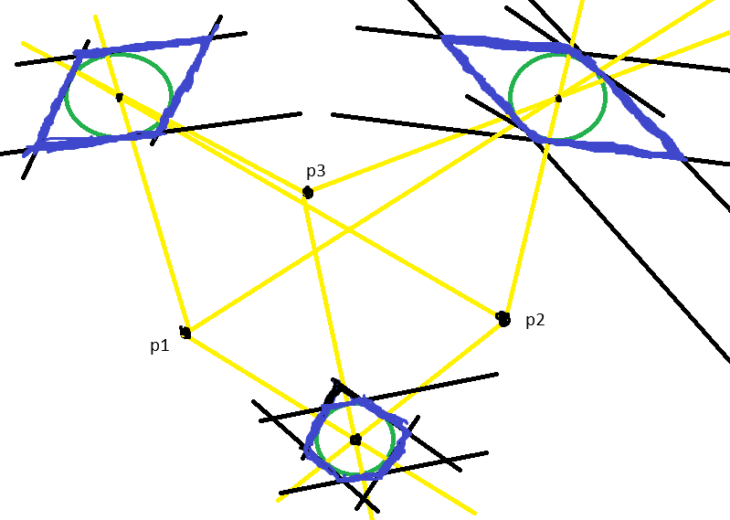
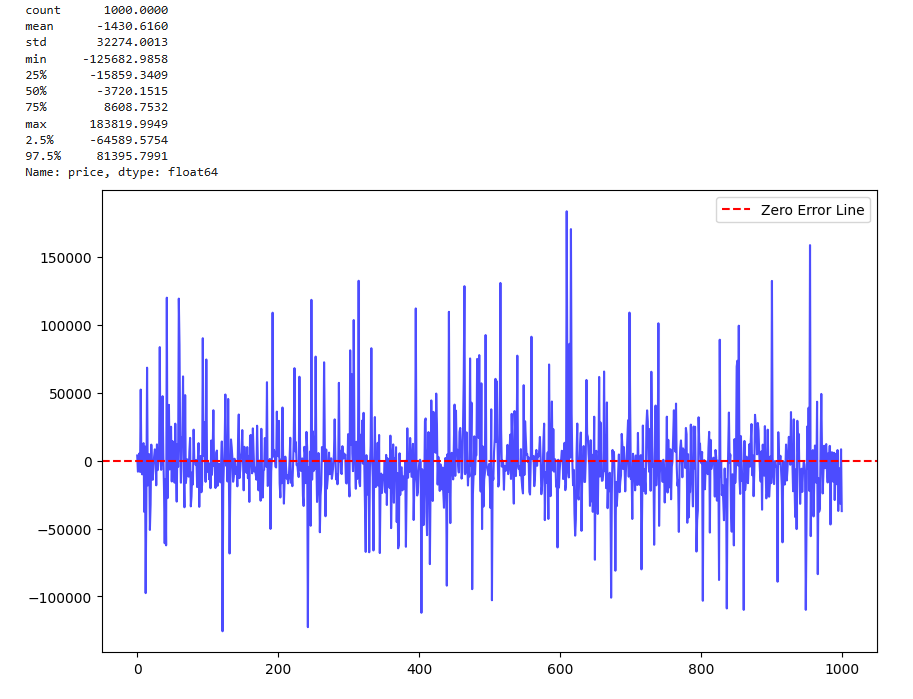

---
header-includes:
- \usepackage{natbib}
- \usepackage[fontsize=12pt]{scrextend}
- \usepackage{indentfirst}
- \usepackage{setspace}
- \usepackage[singlelinecheck=false]{caption}
- \usepackage{float}
- \usepackage{sectsty}
output:
  pdf_document:
    latex_engine: xelatex
    number_sections: true
    extra_dependencies:
    - booktabs
    - caption
indent: yes
geometry: left=3.5cm,right=2.95cm,top=2cm,bottom=2cm
editor_options: 
  markdown: 
    wrap: sentence
---

\onehalfspacing

```{r setup_and_load_data, echo=FALSE, warning = FALSE, message = FALSE}
knitr::opts_chunk$set(warning = FALSE, message = FALSE, echo=FALSE) 
```

\allsectionsfont{\centering}
\subsectionfont{\raggedright}
\subsubsectionfont{\raggedright}

\pagenumbering{gobble}

\begin{centering}

\vspace{3cm}

\vspace{1cm}

\Large
{NATIONAL RESEARCH UNIVERSITY \\ HIGHER SCHOOL OF ECONOMICS}
\normalsize
\\
{\bf International College of Economics and Finance}
\vspace{1cm}


\Large
\doublespacing
Danila Karapsin\\
Anton Ilchuk\\
{\bf Rental prices forecasting}\\
\normalsize
Project\\
38.04.01 ECONOMICS\\
Master's Programme {\bf 'Financial Economics'}

\vspace{1 cm}

\normalsize
\singlespacing


\mbox{}
\vfill
\normalsize
Moscow 2024

\end{centering}

\newpage

\tableofcontents

\newpage

\pagenumbering{arabic}
\setcounter{page}{2}

# Introduction

Our project is devoted to the rental prices forecasting using both geographical features (geo features) and apartments’ features (e.g. floor, square meters, etc).
Note that we are not trying to predict future prices, instead we predict current prices based on a dataset which consists of ads placed on the cian.ru at the end of September 2024.
So, there is no time-series component in our project.

As has been mentioned, we parsed a dataset from Cian.ru, Russia’s leading real estate platform.
Data collection was performed using the Python package cianparser, which allowed us to scrape property listings.
We encountered several challenges during the scraping process.
For example, the platform limits the number of pages that can be accessed for a single query to 54, with each page displaying 28 listings.
We solved this by filtering ads by proximity to certain subway stations (cianparser has a list of all train/subway stations in Moscow).
However, Cian employs IP-blocking mechanisms to limit scraping, so the script for ads collection is only semi-automatic.

The initial dataset includes over 10,000 listings (after duplicates removal), with each entry containing apartments’ features such as rental price, the number of rooms, floor level, total area in square meters, and location information (district, street).
To get coordinates for each flat we used its address and capabilities of packages DaData and geopy (if first fails, the second one usually does the job).
For problematic entries, manual corrections were made.
We also identified and removed outliers, such as listings with unrealistically low or high rental prices, and logged these cases in outliers_to_delete.csv for transparency and reproducibility.
\newpage

# Algorithms selection, metrics and submission plan

For the second submission our goals are the following:

-   **Remove outliers and fix duplicates:** some ads are duplicated, i.e. multiple ads from different real estate agents for the same apartment.
    And we also do not want to have too many luxury apartments in our dataset, since we can not predict prices for them using our features.

-   **Feature engineering:** work with existing features and add new geo features using apartments’ coordinates (proximity to subway stations, parks and other objects)

-   **Feature selection and transformation:** some features, like number of rooms, should be transformed to categorical.

-   **Exploratory data analysis**

-   **Holdout sample selection.**

-   **Preliminary results from models’ fitting:** our plan is to try Random Forest, KNN and Gradient Boosting algorithms.
    At this submission we are planning to provide results from fitting at least 1 algorithm.

We use absolute errors for scoring during cross validation to select the best model.
In terms of business goals it is important to have lower absolute error since we want to have more accurate predictions.
However, as a business metric we may use an interval from 5% quantile to 95% quantile calculated on errors from using our model on the holdout sample.
It is much easier to explain such a metric to managers, e.g. in 90% of cases our error is within that interval.

\newpage

# Outliers and missing values

Note that some apartments are close to many subway stations, hence we may have duplicates.
However it is quite easy to get rid of them, see the **data_consolidation.py** file for details.
We also removed ads in which street name, house number, floor count and other apartments’ features are not specified.
Also for some apartments rental prices are too low, in most cases people are trying to rent a room instead of the whole apartment (see the **outliers_to_delete.csv** file for details).
As has been mentioned, for some flats we have multiple ads from many real estate agents.
Our methodology to deal with that problem is the following: if we have more than one ad at the same coordinates and floor, we are averaging apartments’ features (see flats_data_final_clean.py for details).
To get rid of luxury real estate we are removing apartments for which rental prices are higher than 95% quantile (that is done in the geo_features_creation.py file which is mostly devoted to feature engineering).

\newpage

# Feature engineering

In our project geo features are the related to the proximity, area or count of certain geographical objects, such as 

-   Schools and vocational schools

-   Boilers, dumps, factories, thermal power plants, waste plants

-   Bus stops

-   Hospitals

-   Subway and train stations

-   Train and bus terminals

For almost all features except 2) we used [data.mos.ru](https://data.mos.ru/).
For ecological geo features, we used [https://mwmoskva.ru/ekologicheskaya-karta-moskvy.htm](https://mwmoskva.ru/ekologicheskaya-karta-moskvy.html)l page, which has a map of such places.
Using F12 key it is quite easy to download json file and parse it for our needs (see the eco_load.py file for details) 

When data is collected, we only need to compute needed features.
There are 3 ways to do it:

1.  **«Brute force»**: every time, for every geo object we may calculate the distance between it and every flat.
    And then compute required geo features.
    Note that for some objects (e.g. parks) we have not points, but polygons.
    In that cases we are checking distance from the flat to every point which forms that polygon.
    No need to explain why that it is very computationally intensive. 
     

2.  **«Clustering»**: we can group flats and geo objects by clusters and then compute distances and geo features.
    We are reducing computational intensity, but losing some information: some apartments may be located at the edge of the geo sector, and it can be that there are a lot of geo objects in the neighbouring sector.

3.  **«Wise way»**: we need to select 3 points in such a way that we can not draw a line through all of them.
    Then we are computing a distance from every geo object to that 3 index points.
    Then, suppose that we want to count number of shops within a 1 km radius from a certain flat. 

    Suppose that the distance from that apartment to the 1st point is 10km.
    Then it is easy to see that if the shop is within 1 km radius from the flat its distance from the 1st point should be between 9km and 11km.
    We are applying the same principle for all of our index points.
    Then instead of computing distance from our apartment to every flat we can just filter index point distances.
    To see how it limits our search area see the sketch below (blue - search areas, p1, p2, p3 - index points, green - ideal search area).



We did not want to lose any info, that is why we did apply a clustering approach.
Smart way has been discovered too late.
That is why we used a brute force approach in our project, it took almost 4 days to complete computations, but now we know how to do it fast in a wise way.

\newpage

```{r setup}
library(reticulate)
use_virtualenv("r-reticulate", required = TRUE)
```

# EDA, map plots

```{python, fig.width=10, fig.height=8}
import pandas as pd
import matplotlib.pyplot as plt
import seaborn as sns
import numpy as np
from math import pi
import sys
sys.path.append('py')
from geo_plot_funs import *

df = pd.read_csv('csv//meta_geo_df.csv')
df['geoData'] = parse_str_to_polygon(df['geoData'])
df = create_gdf(df)

df['dist'] = df['geometry'].apply(lambda x: closest_dist_geo_obj(Point((55.755787, 37.617764)), x)/1000)
df = df.query("dist < 50")

df['swapped_geometry'] = df.geometry.apply(lambda x: fix_geo_obj(x, reverse = True))
df = df.set_geometry('swapped_geometry')

plot_group(filter_df(df, ['shops']),
           show_legend = True,
           colors = {"shops": "blue"}
)
```

```{python, fig.width=10, fig.height=8}
plot_group(filter_df(df, 
                     ['parks']
            ), 
           show_legend = True, 
           colors = {"parks": "green"}
)
```

```{python, fig.width=10, fig.height=8}
plot_group(filter_df(df, ['flats']),
           show_legend = True,  
           colors = {"flats": "red"}
)
```

```{python, fig.width=10, fig.height=8}
plot_group(filter_df(df, 
                     get_group_with_pattern(df, 
                                            'eco'
                     )
            ), 
           colors = {"eco_boiler": "red",
                     "eco_factory": "brown",
                     "eco_waste": "green",
                     "eco_dump": "black",
                     "eco_thermal": "orange"
                    },
           show_legend = True, 
           marker_size = 15
)
```

```{python, fig.width=10, fig.height=8}
plot_group(filter_df(df, 
                     get_group_with_pattern(df, 
                                            'bus_stop'
                     )
            ), 
           show_legend = True, 
           marker_size = 0.1
)
```

```{python, fig.width=10, fig.height=8}
plot_group(filter_df(df, 
                     get_group_with_pattern(df, 
                                            'station'
                     )
            ), 
           show_legend = True, 
           marker_size = 15
)
```

```{python, fig.width=10, fig.height=8}
edu_df = df.copy()
edu_df['swapped_geometry'] = edu_df['swapped_geometry'].centroid
edu_df = edu_df.set_geometry('swapped_geometry')
plot_group(filter_df(edu_df, 
                     get_group_with_pattern(edu_df, 
                                            'edu'
                     )
            ), 
           show_legend = True, 
           marker_size = 15
)
```

```{python, fig.width=10, fig.height=8}
plot_group(filter_df(df, 
                     get_group_with_pattern(df, 
                                            'hospit'
                     )
            ), 
           show_legend = True, 
           marker_size = 15
)
```

\newpage

# EDA, other plots

Below is the table with some descriptive statistics for our sample.

```{python}

df = pd.read_csv('csv//data_for_report.csv')

descrs_stats = (pd.read_csv('csv//data_for_report.csv')
                 .describe()
                 .transpose()
                 .drop(['count', 'std', 'min'], axis = 1)
                 .round(2)
                )
```

```{r}
library(reticulate)
knitr::kable(py$descrs_stats)
```

The most noticeable relationship is between size of the apartment and rental price and total floor count in the building (but not always), see the plots below.

```{python}
feature = 'meters'
plt.figure(figsize=(12, 6))
sns.scatterplot(data=df, x=feature, y='price', color='darkgreen', alpha=0.7)
plt.title(f'Scatter Plot: {feature} vs Price')
plt.xlabel(feature)
plt.ylabel('Price')
plt.tight_layout()
plt.show()
plt.close()
```

```{python}
feature = 'floors_total'
plt.figure(figsize=(12, 6))
sns.scatterplot(data=df, x=feature, y='price', color='darkgreen', alpha=0.7)
plt.title(f'Scatter Plot: {feature} vs Price')
plt.xlabel(feature)
plt.ylabel('Price')
plt.tight_layout()
plt.show()
plt.close()
```

Also we can see that there are no apartments with high rental price which are very close to dumps.
Also if apartment is to far from the closest shop, its rental price is never too high.

```{python}
feature = 'eco_dump_closest_km'
plt.figure(figsize=(12, 6))
sns.scatterplot(data=df, x=feature, y='price', color='darkgreen', alpha=0.7)
plt.title(f'Scatter Plot: {feature} vs Price')
plt.xlabel(feature)
plt.ylabel('Price')
plt.tight_layout()
plt.show()
plt.close()
```

```{python}
feature = 'shops_closest_km'
plt.figure(figsize=(12, 6))
sns.scatterplot(data=df, x=feature, y='price', color='darkgreen', alpha=0.7)
plt.title(f'Scatter Plot: {feature} vs Price')
plt.xlabel(feature)
plt.ylabel('Price')
plt.tight_layout()
plt.show()
plt.close()
```

The graph below presents density plots for apartments with different numbers of rooms.
As can be seen, on average, a higher number of rooms implies higher rental price, but five-room apartments break this rule.
It might be because we have only 10 ads for such apartments in our sample (see the bar chart above).

```{python}
dfold = pd.read_csv("csv//flats_data_coords.csv")
dfold['log_price'] = np.log(dfold['price'])

plt.figure(figsize=(12, 8))
for rooms in [1, 2, 3, 4, 5]:
    sns.kdeplot(dfold[dfold['rooms'] == rooms]['log_price'],
                label=f'{rooms}', fill=True)

plt.title('Log-Transformed Density Plot of Prices by Number of Rooms')
plt.xlabel('Log(Price)')
plt.ylabel('Density')
plt.legend(title='Rooms:')
plt.show()
```

Notice that there are no high price apartments which are really far from the city center.

```{python}
feature = 'center_dist'
plt.figure(figsize=(12, 6))
sns.scatterplot(data=df, x=feature, y='price', color='darkgreen', alpha=0.7)
plt.title(f'Scatter Plot: {feature} vs Price')
plt.xlabel(feature)
plt.ylabel('Price')
plt.tight_layout()
plt.show()
plt.close()
```

\newpage

# Feature selection and transformation + holdout sample

-   Features related to distances higher than 5km were removed (we can check map of Moscow and realize that that is too much)

-   Using pd.get_dummies() we transformed rooms count to categorical variable

-   Random 1000 rows from our dataset were removed and placed into the file holdout.csv

    \newpage

# ML models preliminary results

During this stage we found that the gradient boosting algorithm provided too good errors on a holdout sample (in 95% of cases errors were within -30;30 rubles interval).
After investigation we discovered that the information leak happened.

Features related to the number of places in which there are rental ads (‘other_flats’ prefix) had been calculated for the whole sample, and then it was splitted.
That means that the training sample ‘knows’ something from the holdout sample in advance, and that leads to overfit.

To fix that we recalculated these features for the training sample pretending that we do not have a holdout sample.
That fixed the issue.

Below are the summary statistics and plot for the errors which are derived from the applying gradient boosting model on our holdout sample.
To do preliminary fine tuning, we did grid search and 5 fold cross validation.
[See the ipynb folder, "models" notebook for the details (it is quite messy though)]{.underline}.



\newpage

# Code

Code is available at this github repo: <https://github.com/Karapsin/ICEF_ML_Project> Below is the brief description of its structure.

Folders:

-   **data load:** csv files from cian parser

-   **ipynb:** some Jupyter notebooks for visualizations

-   **json:** for now single json file with info about ecological geo features

-   **csv:** different kind of csv

-   **py:** python scripts for data load, cleaning and features engineering

Py folder:

-   **Data load folder:** various py scripts for data loading (names are pretty self explanatory)

-   **Geo_funs.py:** functions for coordinates loading and working with points, multipoints, polygon and multipolygons objects from geopandas package

-   **Features_funs.py:** functions used for geo features creation

-   **Geo_plot_funs.py:** functions for plotting maps with points and polygons on top

-   **Flats_data_final_clean.py:** data cleaning procedure

-   **Meta_geo_df.py:** creation of the df for plots with map

-   **map_graph.py:** interactive map creation

Csv folder:

-   **Csv_to_split folder:** during features creation this csv files are splitted

-   **Finished_geo_features folder**: files with calculated geo features

-   **Object coords folder:** csv with geo objects coordinates, used to calculate geo features

-   **Clean_data.csv:** data after duplicates and missing values removal, with coordinates

-   **consolidated_data.csv:** data before duplicates removal, but with duplicates.
    Composed from csv files from data load folder

-   **Data_for_nodelling.csv:** data to be used for ML models fit

-   **Data_for_report.csv:** data for this submission

-   **Flats_data_coords.csv:** data with coordinates and duplicates, but without missing values

-   **Holdout.csv:** holdout sample

-   **Manual_coords.csv:** locations for which coordinates had been found manually

-   **Meta_geo_df.csv:** file with all geo objects, their coordinates and types, used for map plots

-   **Outliers_to_delete.csv:** pretty self explanatory

-   **Same_coords.csv:** ads at the same coords and floor as at least 1 another ad
